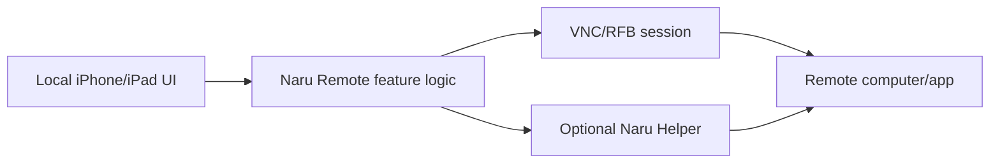

# Implementation Plan: [FEATURE]

**Branch**: `[###-feature-name]` | **Date**: [DATE] | **Spec**: [link]  
**Product**: Naru Remote  
**Input**: Feature specification from `/specs/[###-feature-name]/spec.md`

**Note**: This template is filled in by `$speckit-plan`. Keep product behavior
in `spec.md`; put architecture, adapters, data flow, and verification here.

## Summary

[Extract primary user outcome from spec and summarize the technical approach.]

## Technical Context

**Language/Version**: [Swift version, macOS helper language, or NEEDS CLARIFICATION]  
**Primary Dependencies**: [VNC/RFB library, networking, image/clipboard helpers, or NEEDS CLARIFICATION]  
**Storage**: [UserDefaults, Keychain, SwiftData/CoreData, files, or N/A]  
**Testing**: [XCTest, XCUITest, fake RFB server, helper tests, manual device checks]  
**Target Platform**: [iOS/iPadOS version, macOS helper target, remote OS targets]  
**Project Type**: [iOS app / macOS helper / shared Swift package / test fixture]  
**Performance Goals**: [connection latency, frame rate, paste latency, memory, or N/A]  
**Constraints**: [App Store, Tailscale posture, clipboard, sandbox, permissions]  
**Scale/Scope**: [number of hosts, profiles, sessions, target remote OS matrix]

## Constitution Check

*GATE: Must pass before Phase 0 research. Re-check after Phase 1 design.*

| Principle | Gate Question | Result |
| --- | --- | --- |
| Input Is Composed Locally | Does the feature define local composition, remote injection, fallback, and clipboard impact? | [PASS/FAIL/N/A] |
| Tailnet-Native | Does the feature prefer private-network flows and avoid public-internet-first UX? | [PASS/FAIL/N/A] |
| Verification Before Confidence | Is there a verification matrix with realistic evidence? | [PASS/FAIL] |
| Security Boundaries | Are data crossing, retention, permissions, logs, and approvals defined? | [PASS/FAIL] |
| Agent Traceability | Can tasks map to requirements, user stories, file ownership, and tests? | [PASS/FAIL] |
| Phone-First, iPad-Graceful | Does the verification matrix list an iPhone path before any iPad path (IME, soft-keyboard, PiP, reconnect-across-cellular)? Are iPad-only affordances (Stage Manager, multi-window, external display) layered enhancements rather than shipping gates? | [PASS/FAIL/N/A] |

## Architecture Decision

### Selected Approach

[Describe the chosen architecture in concrete terms.]

### Alternatives Considered

| Alternative | Why Rejected |
| --- | --- |
| [Alternative] | [Reason] |

## Data Flow



Update the diagram so it reflects the actual feature. Remove helper or VNC paths
that do not apply.

## Verification Matrix

| Requirement/User Story | Test Level | Tool/Environment | Evidence Required | Owner |
| --- | --- | --- | --- | --- |
| [US/FR] | [unit/integration/UI/manual] | [XCTest/fake RFB/device/helper] | [command/screenshot/log/checklist] | [human/agent] |

## Project Structure

### Documentation (this feature)

```text
specs/[###-feature]/
├── spec.md
├── plan.md
├── research.md
├── data-model.md
├── quickstart.md
├── contracts/
└── tasks.md
```

### Source Code (repository root)

Replace this placeholder with the real paths chosen for the feature.

```text
NaruRemote/
├── App/
├── Features/
├── VNC/
├── InputBridge/
├── Tailnet/
├── Diagnostics/
└── Tests/

NaruHelper/
├── Sources/
└── Tests/

TestFixtures/
└── FakeRFBServer/
```

**Structure Decision**: [Document the selected subset and rationale.]

## Phase 0: Research

List unstable or risky questions that must be settled before design:

- [Protocol/API/policy/library question]
- [Remote OS compatibility question]
- [App Store/sandbox/permission question]

Research output goes to `research.md` with:

- Decision
- Rationale
- Alternatives considered
- Source links when the answer could change over time

## Phase 1: Design & Contracts

Produce only the artifacts that apply:

- `data-model.md`: saved profiles, sessions, helper state, diagnostics, or N/A
- `contracts/`: RFB notes, helper IPC schema, URL schemes, App Intents, file
  staging contract, or N/A
- `quickstart.md`: how to run the feature and verify acceptance criteria

## Complexity Tracking

> Fill only if Constitution Check has violations that must be justified.

| Violation | Why Needed | Simpler Alternative Rejected Because |
| --- | --- | --- |
| [Violation] | [Reason] | [Alternative rejected] |
