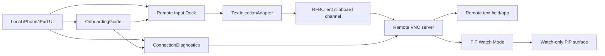

# Implementation Plan: Naru Remote MVP

**Branch**: `main` (active feature pinned by `.specify/feature.json`) | **Date**: 2026-04-29 | **Spec**: `specs/001-naru-remote-mvp/spec.md`  
**Product**: Naru Remote  
**Input**: Feature specification from `specs/001-naru-remote-mvp/spec.md`

## Summary

Build the first vertical slice of Naru Remote: saved private VNC profiles,
staged connection diagnostics, a basic iPad-first VNC session view, local
Compose & Send using VNC clipboard paste mode, first-run onboarding, an
app-driven Connect path into the RFB boundary, repeated raw framebuffer update
requests against a fake server, a cancellable frame pump plus first raw
framebuffer preview path, long-lived app frame streaming with stale-stream
cancellation, incremental raw framebuffer compositing with dirty-region/change
metadata, VNC password authentication at the RFB boundary, app-level
credentialRef/Keychain password lookup, and the first app-driven watch-only PiP
state boundary. The MVP proves the core product claim before adding full-rate
Metal rendering, fully device-verified system PiP, voice, image paste,
helper-native insertion, or agent handoff.

Current roadmap is tracked in `docs/ROADMAP.md`.

## Technical Context

**Language/Version**: Swift 6.2.3 via SwiftPM; Xcode 26.2 available for the later iOS/iPadOS app target  
**Primary Dependencies**: Swift Package core module; generated Xcode app target; first-party Swift RFB MVP boundary; platform networking; CommonCrypto for VNC password challenge-response; AVKit/AVFoundation evaluation for PiP renderer; secure storage for credentials  
**Storage**: Saved profile metadata in app-local persistence; credentials in Keychain when implemented  
**Testing**: XCTest, fake RFB server/fixture tests, XCUITest or screenshot review, manual iPhone/iPad IME checks  
**Target Platform**: iPhone/iPad first; initial remote OS matrix is macOS, Linux, Windows VNC servers  
**Project Type**: iOS/iPadOS mobile app with future optional macOS helper  
**Performance Goals**: First frame from compatible local/tailnet fixture without UI freeze; compose send completes with clear status under normal latency  
**Constraints**: App Store sandbox, VNC/RFB compatibility variance, Tailscale is external, no public-internet-first UX, no helper dependency in MVP  
**Scale/Scope**: Single active controllable session, first-run setup checklist, optional watch-only PiP state for a frame-bearing session, saved profiles, MVP diagnostics, text-only input bridge, one live no-auth first-frame connection attempt from the app shell, a tested repeated raw framebuffer update primitive in the core RFB client, incremental raw framebuffer compositing with dirty rectangles and change activity, long-lived app frame streaming for streaming-capable connectors, and a sampled SwiftUI preview path

## Constitution Check

*GATE: Must pass before Phase 0 research. Re-check after Phase 1 design.*

| Principle | Gate Question | Result |
| --- | --- | --- |
| Input Is Composed Locally | Does the feature define local composition, remote injection, fallback, and clipboard impact? | PASS |
| Tailnet-Native | Does the feature prefer private-network flows and avoid public-internet-first UX? | PASS |
| Verification Before Confidence | Is there a verification matrix with realistic evidence? | PASS |
| Security Boundaries | Are data crossing, retention, permissions, logs, and approvals defined? | PASS |
| Agent Traceability | Can tasks map to requirements, user stories, file ownership, and tests? | PASS |

## Architecture Decision

### Selected Approach

Use a small vertical architecture with explicit adapters:

- `ConnectionProfileStore`: saved private VNC profiles, recent/favorite metadata,
  file-backed app-local persistence, and profile-level PiP Watch opt-out
- `ConnectionDiagnostics`: DNS/MagicDNS, TCP, RFB handshake, auth, first-frame, clipboard capability
- `RFBClient`: first-party MVP VNC/RFB boundary for deterministic handshake,
  no-auth first-frame fixture coverage, repeated raw framebuffer update
  requests, and later library replacement
- `RFBRawFramebufferDecoder`: 32-bit true-color raw rectangle decoding into an
  RGBA framebuffer model as the first pixel-rendering foundation, including
  previous-frame compositing for incremental updates, dirty rectangles, changed
  pixel counts, and change activity
- `RFBFramePump`: cancellable repeated framebuffer update loop boundary that
  starts with a full update, uses incremental requests for later frames, and
  carries damage/change metadata for renderer and PiP policy decisions
- `RemoteSessionViewModel`: session state, connection HUD, frame/render state, reconnect state
- `RemoteInputDock`: local compose surface and send status
- `TextInjectionAdapter`: MVP adapter that uses VNC clipboard set plus remote
  paste command, reporting `unknown` unless a confirmation source proves remote
  app acceptance
- `DiagnosticExport`: user-safe diagnostic summaries that omit stage details by
  default and use a fixed safe detail catalog for explicit detail exports
  instead of caller-provided raw diagnostic strings
- `NaruRemoteAppModel`: app-shell state coordinator for profile selection,
  profile creation, connection checks, and the first live no-auth first-frame
  connection action
- `OnboardingGuide`: derived safe checklist state for private target setup,
  diagnostics, local compose readiness, and PiP Watch readiness
- `PiPWatchSession`: watch-only session state that disables input on the PiP
  surface, requires a received remote frame, respects profile opt-out, and
  tracks unavailable, watching, stale, failed, and stopped states
- `PiPFramePolicy`: adaptive low-FPS policy for offering remote frames to a PiP
  renderer without treating PiP as an interactive control surface. The app
  model can start/stop/refresh the core watch lifecycle from active frames; the
  app layer now has a sample-buffer renderer boundary that converts remote
  framebuffers into `CVPixelBuffer`/`CMSampleBuffer`, feeds an
  `AVSampleBufferDisplayLayer`, creates an iOS
  `AVPictureInPictureController` content source, and wires that controller into
  the app model for start/stop plus initial/subsequent frame enqueue. Physical
  iPhone/iPad PiP behavior and background-mode policy still need verification
  before full support is claimed.

The MVP must not require `Naru Helper`. Helper-native insertion is designed as a
future adapter behind the same input bridge boundary.

### Alternatives Considered

| Alternative | Why Rejected |
| --- | --- |
| Start with Naru Helper first | It would prove native paste but not the no-helper VNC baseline users expect from a viewer. |
| Key-event text injection first | It fails the product thesis for Korean/IME-heavy input and should remain a compatibility fallback only. |
| Tailscale API inventory first | It improves discovery but is not required to prove private host connection and Compose & Send. |
| Image paste first | Valuable but depends on connection/session/input diagnostics being in place. |

## Data Flow



## Verification Matrix

| Requirement/User Story | Test Level | Tool/Environment | Evidence Required | Owner |
| --- | --- | --- | --- | --- |
| US1 / FR-001 profile persistence | Unit | XCTest | Saved profile round-trip passes | Agent |
| US1 / FR-018 persistence failure/retry | Unit/UI | XCTest | Failed add/edit/delete preserves published and credential state, concurrent mutations serialize without orphan secrets, editor/delete alert keeps fixed retry UI, retry succeeds | Agent |
| US1 / FR-003 staged diagnostics | Integration | Fake DNS/TCP/RFB fixtures | Distinct DNS/TCP/handshake failures | Agent |
| US2 / FR-004 session first frame | Integration/UI | Fake RFB server + UI harness | Known frame received/render state captured | Agent + human review |
| US3 / FR-005 local compose | Unit/UI | XCTest + iPad manual | Unicode draft preserved exactly | Agent + human |
| US3 / FR-006 clipboard paste | Integration | Fake RFB clipboard fixture | UTF-8 `ClientCutText` payload and paste key-event sequence emitted; state remains `unknown` without confirmation | Agent |
| US3 / FR-007 failed send retention | Unit/UI | XCTest | Draft remains after failed or unknown send | Agent |
| US4 / FR-009 privacy export | Unit | XCTest | Default export omits raw details; explicit details come from a fixed safe stage catalog | Agent |
| US5 / FR-011 PiP watch state | Unit/UI | XCTest + XCUITest | Watch mode disables PiP-surface input and exposes stale/unsupported status | Agent |
| US5 / FR-014 profile PiP opt-out | Unit/UI | XCTest + XCUITest | Sensitive profile policy prevents PiP availability and no-op UI start actions | Agent |
| US6 / FR-015 onboarding | Unit/UI | XCTest + XCUITest | First-run checklist shows safe next step and does not echo composed text or credential detail | Agent |

## Project Structure

### Documentation (this feature)

```text
specs/001-naru-remote-mvp/
├── spec.md
├── plan.md
├── research.md
├── data-model.md
├── quickstart.md
├── contracts/
│   ├── diagnostics.md
│   ├── pip-watch.md
│   └── text-injection.md
└── tasks.md
```

### Source Code (repository root)

Current foundation:

```text
project.yml
NaruRemote.xcodeproj/
Package.swift
NaruRemote/
├── iOSApp/
│   └── NaruRemoteApplication.swift
├── UITests/
│   └── NaruRemoteLaunchUITests.swift
├── App/
│   ├── AppShell/
│   └── Features/
│       ├── ConnectionHub/
│       ├── Diagnostics/
│       ├── Onboarding/
│       ├── RemoteInputDock/
│       └── SessionViewer/
├── Sources/
│   └── NaruRemoteCore/
│       ├── ConnectionHub/
│       ├── Diagnostics/
│       ├── Onboarding/
│       ├── RemoteInputDock/
│       ├── SessionViewer/
│       ├── PiPWatchMode/
│       └── VNC/
└── Tests/
    ├── NaruRemoteAppTests/
    ├── FakeRFBServerKitTests/
    └── NaruRemoteCoreTests/

TestFixtures/
└── FakeRFBServer/
    ├── Executable/
    ├── Fixtures/
    └── ServerKit/
```

Deferred helper-era layout, not part of this MVP slice:

```text
NaruRemote/
├── App/
├── Features/
│   ├── ConnectionHub/
│   ├── SessionViewer/
│   ├── RemoteInputDock/
│   └── Diagnostics/
├── VNC/
├── Persistence/
└── Tests/

TestFixtures/
└── FakeRFBServer/
```

**Structure Decision**: Keep Swift Package targets (`NaruRemoteCore` and
`NaruRemoteApp`) for fast agent-driven model and presentation tests, and use
XcodeGen (`project.yml`) to generate the installable iOS/iPadOS app bundle and
XCUITest target. The fake RFB fixture executable and production
`RFBClientBoundary` fake-server integration are in place for both the original
no-auth transcript probe and the newer interactive no-auth first-frame
handshake. Do not add the macOS helper target until the helper spec starts.

## Phase 0: Research

Research items are captured in `research.md`:

- VNC/RFB client strategy
- Fake RFB server strategy
- Clipboard text injection compatibility
- PiP Watch Mode feasibility and watch-only boundary
- iOS secure storage/persistence
- Manual-device IME verification

## Phase 1: Design & Contracts

Artifacts:

- `data-model.md`: profiles, diagnostic runs, remote sessions, compose drafts
- `contracts/diagnostics.md`: staged diagnostic contract
- `contracts/text-injection.md`: MVP text injection contract
- `contracts/pip-watch.md`: PiP Watch Mode contract
- `quickstart.md`: how to validate MVP acceptance criteria once code exists

## Complexity Tracking

| Violation | Why Needed | Simpler Alternative Rejected Because |
| --- | --- | --- |
| None | N/A | N/A |
