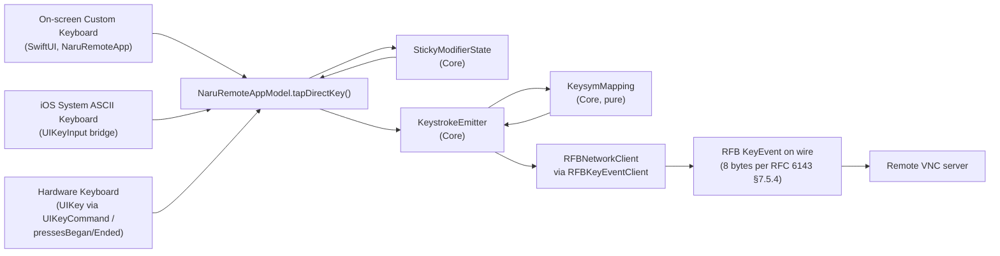

# Implementation Plan: Direct Keystroke Streaming Mode

**Branch**: `feat/plan-direct-keystroke-mode` (active feature pinned by `.specify/feature.json`) | **Date**: 2026-05-02 | **Spec**: `specs/002-direct-keystroke-mode/spec.md`
**Product**: Naru Remote
**Input**: Feature specification from `specs/002-direct-keystroke-mode/spec.md`

## Summary

Add a second peer input mode to the Remote Input Dock alongside Compose & Send. When active, Naru hides the iOS system keyboard, shows a custom in-app soft keyboard with two pages (QWERTY + special keys, bottom-docked, Chrome Remote Desktop Android pattern), and emits one RFB `KeyEvent` (down then up) per on-screen tap or hardware-keyboard press / release. Modifiers (Ctrl / Shift / Alt / Cmd) are sticky (1-tap one-shot, 400 ms double-tap to lock); the QWERTY and hardware paths share a single X11 keysym table to keep them byte-identical on the wire (SC-005). Floating keyboard UI is an explicit Non-Goal.

The feature lives across three modules following the dependency rule `iOSApp → NaruRemoteApp → NaruRemoteCore`:

- `NaruRemoteCore` gains a new RFB capability protocol `RFBKeyEventClient`, a pure-logic `KeysymMapping` table, a `StickyModifierState` machine, and a `DirectKeystrokeMode` toggle on the `RemoteInputDock` sub-model. Production `RFBNetworkClient` adopts the new protocol.
- `NaruRemoteApp` gains a SwiftUI `DirectKeystrokeKeyboardView` mounted in the existing dock, a hardware-keyboard handler via `UIKeyCommand` / `pressesBegan` / `pressesEnded` on the session view, the persistent "Direct mode" badge, and the one-time-per-session entry warning.
- `iOSApp` is unchanged — `NaruRemoteApplication` continues to wire `NaruRemoteAppModel` from concrete persistence types only.

## Technical Context

**Language/Version**: Swift 6 / Swift 6 concurrency, SwiftPM-driven inner loop, Xcode 26.2 for the iOS app target
**Primary Dependencies**: existing first-party RFB MVP boundary; UIKit `UIKey` / `UIPress` / `UIKeyCommand` for hardware passthrough; AVFoundation untouched
**Storage**: none new — Direct mode is in-memory state on `NaruRemoteAppModel`; resets on every session start (FR-014). No persistence file changes.
**Testing**: XCTest for keysym table + sticky-modifier transitions + emitter; `FakeRFBServer` recording for byte-level wire output (RFC 6143 §7.5.4); XCUITest on iPhone 17 Pro simulator for mode toggle, custom-keyboard appearance, badge visibility; manual physical-iPhone verification for vim navigation, `Tab` completion, `Ctrl-R` history, and Bluetooth Magic Keyboard hardware passthrough
**Target Platform**: iPhone 17 Pro (constitution §VI canonical), iOS 17+; iPad-graceful through SwiftUI scaling. Remote OS matrix unchanged from MVP (macOS, Linux, Windows VNC servers).
**Project Type**: iOS/iPadOS app, no helper changes; SwiftPM core test loop primary
**Performance Goals**: per-key latency ≤ 16 ms 95p from on-screen tap completion to RFB write completion (SC-004) — within one render frame on iPhone. No frame-rate regression on the existing session viewport while Direct mode is active.
**Constraints**: constitution §I "MAY" exception (the feature is the named exception — Direct mode is the explicit user-opt-in path where remote key events are the *primary* path); §IV "no keystroke content in logs" (SP-005); §VI "iPhone first" verification matrix; App Store sandbox unchanged (no new entitlements; no `UIKeyCommand` permission needed); no new `UIBackgroundModes` (PiP `audio` mode from PR #24 is unrelated)
**Scale/Scope**: one DirectKeystrokeMode toggle per active session; one StickyModifierState per active session; ~100 keysyms in the table (printable ASCII + special keys + modifiers); two keyboard pages

## Constitution Check

*GATE: Must pass before Phase 0 research. Re-check after Phase 1 design.*

| Principle | Gate Question | Result |
| --- | --- | --- |
| Input Is Composed Locally | Does the feature define local composition, remote injection, fallback, and clipboard impact? | **PASS with named exception** — Direct mode is the explicit constitution §I "MAY" exception (remote key events as primary, user opt-in). Spec IN-001 names it; Compose & Send remains the default IME path; clipboard untouched (IN-004); fallback is "drop silently when not `.active`" (IN-003). |
| Tailnet-Native | Does the feature prefer private-network flows and avoid public-internet-first UX? | **N/A** — feature does not touch connection layer; rides on existing VNC session. |
| Verification Before Confidence | Is there a verification matrix with realistic evidence? | **PASS** — `FakeRFBServer` recording proves byte-level wire output; XCUITest on iPhone simulator proves UI; manual iPhone + Bluetooth Magic Keyboard test gates ship. |
| Security Boundaries | Are data crossing, retention, permissions, logs, and approvals defined? | **PASS** — SP-001 names X11 keysyms as the only data crossing; SP-002 confirms zero retention on device; SP-005 forbids keystroke content in logs / diagnostics; one-time per-session warning (FR-009) plus persistent badge (FR-010) cover approval. |
| Agent Traceability | Can tasks map to requirements, user stories, file ownership, and tests? | **PASS** — `tasks.md` (next phase) will pin each task to FR-### / US-# plus exact write set; this plan establishes the file boundaries below. |
| Phone-First, iPad-Graceful | Does the verification matrix list an iPhone path before any iPad path? Are iPad-only affordances layered enhancements rather than shipping gates? | **PASS** — every spec acceptance row lists iPhone (simulator or physical) before any iPad row; Stage Manager, Slide Over, multi-window, external display are explicitly *not* gating; iPad path is graceful SwiftUI scaling only. |

## Architecture Decision

### Selected Approach

Mirror the existing capability-protocol pattern in `RFBClientBoundary.swift` rather than introducing a new orthogonal layer.

**Core (`NaruRemoteCore`):**

1. **`RFBKeyEventClient`** — new capability protocol next to `RFBPointerEventClient`:

   ```swift
   public protocol RFBKeyEventClient: AnyObject, Sendable {
       func sendKeyEvent(keysym: UInt32, isDown: Bool) async throws
   }
   ```

   `RFBStreamingClient` composes it. `RFBNetworkClient` adopts it (3-line method calling the **already-existing** `RFBClientMessageEncoder.keyEvent(keysym:isDown:)` then `sendData(...)` — same shape as `sendPointerEvent`).

2. **`RFBClientMessageEncoder.keyEvent(keysym:isDown:)` (existing)** — already in the codebase since the Compose & Send `pasteCommand` work; produces the 8-byte RFB `KeyEvent` per RFC 6143 §7.5.4: `[type=4 (1 byte), isDown (1 byte: 1 or 0), padding (2 bytes: 0,0), keysym big-endian (4 bytes)]`. Pure, unit-testable. This feature reuses it as-is — no new encoder method is added. The codebase convention is method names without an `encode` prefix (`clientCutText`, `pasteCommand`, `keyEvent`); the recent `encodePointerEvent` is an outlier and renaming it for symmetry is out of scope here.

3. **`KeysymMapping`** (new file `Sources/NaruRemoteCore/RemoteInputDock/KeysymMapping.swift`) — pure value-type table with two query surfaces:

   ```swift
   public enum KeysymMapping {
       public static func keysym(for character: Character) -> UInt32?
       public static func keysym(for namedKey: NamedKey) -> UInt32
       public enum NamedKey { case backspace, tab, return, escape, ... }
       public static func keysym(forUIKeyCode code: UIKey.Code) -> UInt32?  // App-side only via @available
   }
   ```

   Source-of-truth for both the on-screen and hardware paths (SC-005 byte-identical guarantee). Coverage scope: printable ASCII (`0x20`–`0x7E` map to identical keysym), Backspace (`0xFF08`), Tab (`0xFF09`), Return (`0xFF0D`), Escape (`0xFF1B`), Up/Down/Left/Right (`0xFF52` / `0xFF54` / `0xFF51` / `0xFF53`), F1–F12 (`0xFFBE`–`0xFFC9`), Home / End / PgUp / PgDn / Insert / Delete (`0xFF50` / `0xFF57` / `0xFF55` / `0xFF56` / `0xFF63` / `0xFFFF`), Shift_L / Control_L / Alt_L / Meta_L (`0xFFE1` / `0xFFE3` / `0xFFE9` / `0xFFE7`).

4. **`StickyModifierState`** (new file `Sources/NaruRemoteCore/RemoteInputDock/StickyModifierState.swift`) — value type tracking each of Ctrl / Shift / Alt / Cmd as one of `idle | armed | locked`. Pure state machine: `tap(_ modifier:)` transitions, `consume()` releases armed state after a non-modifier key, `clear()` for FR-013, equality + Codable for unit tests.

5. **`DirectKeystrokeMode`** — value state on the existing dock/app model: `isActive`, custom-keyboard `page`, selected `inputSurface`, and warning status. Defaults to Compose with `.customKeyboard` selected and resets on every connect (FR-014). Legacy decodes without `inputSurface` fall back to `.customKeyboard`.

6. **`KeystrokeEmitter`** — boundary that turns a logical key event (key + down/up + active modifier set) into the actual sequence of `RFBKeyEventClient.sendKeyEvent` calls. For a tap on `c` with `Ctrl` armed it emits four `KeyEvent`s in order: `Ctrl down → c down → c up → Ctrl up`. Lives in `Sources/NaruRemoteCore/RemoteInputDock/KeystrokeEmitter.swift`. Holds an injected `RFBKeyEventClient` (capability protocol injection so production and tests share the path).

**App (`NaruRemoteApp`):**

7. **`DirectKeystrokeKeyboardView`** (new file `App/Features/RemoteInputDock/DirectKeystrokeKeyboardView.swift`) — SwiftUI view with two pages (QWERTY, Special). Bottom-docked via the existing dock geometry. Each key is a `Button` whose action calls a `model.tapDirectKey(_:)` method on `NaruRemoteAppModel`. Modifier keys and the page-toggle button render distinct visual states (idle / armed / locked / pressed). "Clear modifiers" affordance lives on the special-keys page (FR-013).

8. **Hardware keyboard handler** — `DirectKeystrokeResponderView`, a non-`UITextInput` first responder overriding `pressesBegan(_:with:)` / `pressesEnded(_:with:)` for arbitrary character + modifier combinations. It is active on the default custom surface and the hardware-keyboard-only surface. The hardware-only surface renders no software keyboard so Bluetooth / Magic Keyboard use does not obstruct the stream area.

9. **Mode toggle + badge + warning** — added to `RemoteInputDockView`. Toggle is a `Picker(.segmented)` between Compose & Direct. Badge is a small `Label("Direct mode", systemImage: "keyboard")` pinned to the dock header. One-time-per-session warning is a `confirmationDialog(...)` with a "Got it" action that flips a session-scoped `hasShownDirectModeWarning` flag on the model.

10. **Direct input surface picker** — added inside Direct mode. `.customKeyboard` keeps FR-001 and remains the default; `.systemKeyboard` mounts `DirectKeystrokeSystemKeyboardView`, a transparent `UIKeyInput` bridge that maps printable ASCII plus Return / Tab / Backspace into Direct key events and drops non-ASCII committed text; `.hardwareKeyboard` mounts only the raw `UIPress` responder.

**Boundary preserved:**

- `NaruRemoteCore` has no SwiftUI / UIKit imports; the `UIKey.Code` overload of `KeysymMapping` lives in a `#if canImport(UIKit)` block and is consumed only from `NaruRemoteApp`. Core unit tests do not need UIKit.
- `KeystrokeEmitter` accepts the `RFBKeyEventClient` injection — production passes the live `RFBNetworkClient`, tests pass a `FakeRFBKeyEventClient` (already-pattern-matched against the existing `FakeRFBServerKit`).

### Alternatives Considered

| Alternative | Why Rejected |
| --- | --- |
| Use a hidden `UITextField` as the only Direct input path | iOS keyboard runs IME composition + autocorrect + predictive text and lacks Tab / Esc / Ctrl / arrows. It remains unsuitable as the default raw-keystroke source. A later explicit `.systemKeyboard` surface is narrower: ASCII committed text only, autocorrection disabled, non-ASCII dropped, and custom / hardware surfaces remain available. |
| Render the custom keyboard as an `inputAccessoryView` on top of iOS keyboard | Same iOS-keyboard problems, plus the accessory bar is real-estate-starved on iPhone. |
| Floating / repositionable keyboard | Explicit Non-Goal in `spec.md`; deferred to keep v1 small. |
| Synthesize key auto-repeat on press-and-hold (Chrome Remote Android) | Locked to one-shot only by FR-016; rationale in spec — keeps the on-screen and hardware paths byte-identical (SC-005), avoids a local repeat clock the remote does not match. |
| Inject `KeystrokeEmitter` directly into the SwiftUI view | Crosses the layer boundary; testability suffers. The model owns the emitter, the view owns only logical key taps. |
| Put the keysym table in `NaruRemoteApp` so it can use `UIKey.Code` directly | Splits the source-of-truth and violates SC-005 (byte-identical paths). Solved by the `#if canImport(UIKit)` overload pattern. |

## Data Flow



Compose & Send path is unchanged — its arrow goes from a different surface (iOS keyboard via `UITextField`) into `RemoteClipboardTextClient`, never touching `KeystrokeEmitter`.

## Verification Matrix

| Requirement / User Story | Test Level | Tool / Environment | Evidence Required | Owner |
| --- | --- | --- | --- | --- |
| US-1 single tap → 1 down + 1 up `KeyEvent` on wire | Unit + Integration | XCTest + `FakeRFBServer` byte recorder | `swift test`: 8-byte sequence per tap; `type=4`, isDown flag, padding zeros, keysym BE | agent |
| US-1 special-keys page emits Tab / Esc / arrows / F1–F12 | Unit | XCTest on `KeysymMapping` | 100 % coverage of named-key enum cases | agent |
| US-2 sticky `Ctrl` armed → tap `c` → `Ctrl down, c down, c up, Ctrl up` | Unit + Integration | XCTest + `FakeRFBServer` recorder | byte sequence asserts both order and keysym values | agent |
| US-2 double-tap within 400 ms → locked → 3 letters held → tap `Shift` → released | Unit | XCTest on `StickyModifierState` | state-machine assertions; 401 ms gap is treated as a fresh single-tap | agent |
| US-3 hardware `Ctrl-C` over `UIKeyCommand` produces same wire bytes as on-screen `Ctrl`+`c` | Unit | XCTest sharing `KeysymMapping` between paths via the `UIKey.Code` overload | byte-for-byte equality assertion (SC-005) | agent |
| US-3 hardware-key auto-repeat is owned by remote (Naru emits 1 down + 1 up only) | Unit | XCTest mocking `UIPress` lifecycle | exactly one `KeyEvent` down + one up regardless of hold duration | agent |
| US-4 mode toggle preserves Compose draft both directions | Unit (model) | XCTest on `NaruRemoteAppModel` | draft string assertion before / after toggle | agent |
| FR-001 entering Direct mode dismisses iOS keyboard and shows custom keyboard | XCUITest | iPhone 17 Pro simulator, iOS 26.2 | screenshot diff: iOS keyboard absent, custom keyboard present, bottom-docked | agent |
| FR-009 one-time-per-session warning appears on first Direct entry, not on subsequent toggles | XCUITest | iPhone 17 Pro simulator | warning shows on first toggle of fresh session; no warning on subsequent toggles in same session | agent |
| FR-010 persistent "Direct mode" badge visible on session HUD when keyboard collapsed | XCUITest | iPhone 17 Pro simulator | screenshot of dock header with badge while keyboard is collapsed | agent |
| US-5 modifier visual states (idle / armed / locked) distinct | Visual / XCUITest | iPhone 17 Pro simulator + vision pass | screenshot per state stored under `artifacts/screenshots/direct-keystroke/` | agent |
| US-1 vim navigation `Esc h j k l : w q` over real Mac VNC | Manual physical | iPhone (physical) + real Mac VNC | manual log + short screen recording | human |
| US-3 Bluetooth Magic Keyboard typing into remote shell | Manual physical | iPhone (physical) + Bluetooth Magic Keyboard + real Mac VNC | manual log entry + screen recording | human |
| iPad-graceful: dock + custom keyboard scale to iPad without overlap | Visual | iPad Pro 13" simulator | screenshot after iPhone passes (constitution §VI); explicitly graceful | agent |

## Project Structure

### Documentation (this feature)

```text
specs/002-direct-keystroke-mode/
├── spec.md          (already merged in PR #25)
├── plan.md          (this file)
├── research.md      (Phase 0 output)
├── data-model.md    (Phase 1 output)
├── contracts/
│   └── keystroke-emitter.md   (Phase 1 output)
├── tasks.md         (next phase, separate PR)
└── quickstart.md    (post-implementation, separate PR)
```

### Source Code (repository root)

```text
NaruRemote/
├── Sources/NaruRemoteCore/
│   ├── RemoteInputDock/
│   │   ├── KeysymMapping.swift              [NEW]
│   │   ├── StickyModifierState.swift        [NEW]
│   │   ├── KeystrokeEmitter.swift           [NEW]
│   │   ├── DirectKeystrokeMode.swift        [NEW]
│   │   └── (existing TextInjectionAdapter, RemoteInputDock state)
│   └── VNC/
│       ├── RFBClientBoundary.swift          [MODIFIED — add RFBKeyEventClient]
│       ├── RFBClientMessageEncoder.swift    [UNMODIFIED — keyEvent(keysym:isDown:) already exists]
│       └── RFBNetworkClient.swift           [MODIFIED — adopt RFBKeyEventClient (sendKeyEvent → existing keyEvent(...))]
├── App/
│   ├── AppShell/
│   │   └── NaruRemoteAppModel.swift         [MODIFIED — wire DirectKeystroke + emitter]
│   └── Features/
│       └── RemoteInputDock/
│           ├── DirectKeystrokeKeyboardView.swift           [NEW]
│           ├── DirectKeystrokeKeyboardLayouts.swift        [NEW — QWERTY / special pages]
│           ├── ModifierKeyButton.swift                     [NEW]
│           ├── HardwareKeyboardHandler.swift               [NEW — UIKeyCommand/UIPress]
│           ├── KeysymMapping+UIKit.swift                   [NEW — UIKey.Code overload]
│           ├── DirectModeBadge.swift                       [NEW]
│           ├── DirectModeWarningDialog.swift               [NEW]
│           └── RemoteInputDockView.swift                   [MODIFIED — mode picker + badge]

NaruRemote/Tests/
├── NaruRemoteCoreTests/
│   ├── KeysymMappingTests.swift             [NEW]
│   ├── StickyModifierStateTests.swift       [NEW]
│   ├── KeystrokeEmitterTests.swift          [NEW]
│   └── RFBClientMessageEncoderTests.swift   [MODIFIED — extend keyEvent(...) coverage with Direct-mode cases]
├── NaruRemoteAppTests/
│   ├── DirectKeystrokeModeTests.swift       [NEW — model integration]
│   └── RemoteInputDockToggleTests.swift     [NEW]
├── NaruRemoteCoreFakeRFBServerTests/
│   └── KeyEventWireTests.swift              [NEW — fake server byte recording]
└── NaruRemoteUITests/
    └── DirectKeystrokeModeUITests.swift     [NEW — iPhone simulator XCUITest]

TestFixtures/
└── FakeRFBServer/
    └── ServerKit/
        └── FakeRFBClientMessageRecorder.swift   [MODIFIED — add keyEvents recorder]
```

**Structure Decision**: Stay within the existing three-module dependency rule. New Core types live under `RemoteInputDock/` (alongside the existing dock logic). The new RFB capability protocol stays under `VNC/` next to `RFBPointerEventClient`. App-side keyboard view files live under `Features/RemoteInputDock/` next to the existing dock view. The `KeysymMapping+UIKit.swift` extension is the only seam where `UIKey.Code` enters; it lives App-side so Core stays UIKit-free.

## Phase 0: Research

Open questions to settle in `research.md` before final design:

- **R-1** Exact X11 keysym values for the named-key set we ship (Backspace, Tab, Return, Escape, arrows, F1–F12, Home, End, PgUp, PgDn, Insert, Delete, Shift_L, Control_L, Alt_L, Meta_L). Source: `keysymdef.h` from X.Org. Decision needed: whether to ship a generated `enum NamedKey` with explicit values or an opaque table.
- **R-2** `UIKeyCommand` vs `pressesBegan` / `pressesEnded` — which one captures arbitrary key + modifier combinations (not just navigation chords) on iOS? `UIKeyCommand` requires explicit registration per chord; `pressesBegan` gives raw `UIKey` events. We almost certainly need `pressesBegan` for the general path; `UIKeyCommand` only for system-level chords iOS would otherwise eat (e.g., Cmd-Tab interception is not allowed regardless).
- **R-3** Behavior of the iOS `firstResponder` chain when the custom keyboard view appears — does anything in the existing session view need to resign? Specifically, does showing the SwiftUI custom keyboard while a hidden compose `TextField` exists cause focus thrashing?
- **R-4** Cmd-key behavior on iPhone vs iPad — Cmd is `Meta_L` (`0xFFE7`) at the X11 layer, but on iPhone Cmd is reachable only with an attached hardware keyboard; we should confirm `Cmd` on the on-screen keyboard sends `Meta_L` consistently regardless of device class.

## Phase 1: Design & Contracts

Phase 1 produces `data-model.md` and `contracts/keystroke-emitter.md` in this same PR. After this PR merges, `tasks.md` (separate PR) breaks the work into independently testable tasks following the existing `task-id`-per-FR-and-write-set convention.

`quickstart.md` is deferred until after first implementation lands so the runbook reflects actual UI affordances (which key labels, where the toggle lives, how to invoke the debug `FakeRFBServer` for byte-level traces).

## Complexity Tracking

> Fill only if Constitution Check has violations that must be justified.

| Violation | Why Needed | Simpler Alternative Rejected Because |
| --- | --- | --- |
| Constitution §I "remote key events as primary" | Direct mode is the *named exception* in §I — the principle explicitly allows `MAY` for compatibility / opt-in, and the spec wires that opt-in through Compose-as-default + explicit toggle + persistent badge + one-time warning | The simpler "never send raw key events" alternative makes terminal use impossible from iPhone, and the founder's own ICP is sustained AI-coding from phone via terminal — Compose & Send alone cannot drive a shell |
