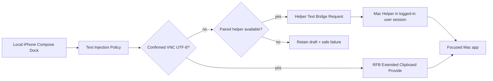

# Implementation Plan: Host Helper Text Bridge

**Branch**: `006-host-helper-text-bridge` | **Date**: 2026-06-05 | **Spec**: [spec.md](./spec.md)  
**Product**: Naru Remote  
**Input**: Feature specification from `/specs/006-host-helper-text-bridge/spec.md`

## Summary

Add an optional helper-native text insertion path for Compose & Send on trusted Macs. The iPhone app keeps VNC as the baseline viewer transport, but when RFB cannot prove a Unicode-safe clipboard path, the app can route a user-confirmed final Compose payload through a paired Mac helper. The first implementation slice should build the state model, diagnostics, fake-helper contract, and app routing before adding the real macOS helper target.

## Technical Context

**Language/Version**: Swift 6 package code; future macOS helper in Swift/AppKit/CoreGraphics  
**Primary Dependencies**: NaruRemoteCore, NaruRemoteApp, RFBNetworkClient, future helper transport over private network or local tailnet endpoint  
**Storage**: Existing profile/app settings for non-secret helper state; Keychain or equivalent secure storage for pairing secret in implementation PR  
**Testing**: XCTest, fake helper endpoint, diagnostic JSON assertions, future macOS helper tests, manual physical iPhone + Mac verification  
**Target Platform**: iOS/iPadOS app plus optional macOS logged-in-user helper  
**Project Type**: iOS app + shared Swift package + future macOS helper target  
**Performance Goals**: helper request dispatch p95 <= 300 ms on local private network excluding permission prompts  
**Constraints**: App Store sandbox, macOS privacy permissions, no public helper exposure, no raw text logs, helper optional  
**Scale/Scope**: One active helper pairing per saved profile for the first slice; macOS first

## Constitution Check

| Principle | Gate Question | Result |
| --- | --- | --- |
| Input Is Composed Locally | Does the feature define local composition, remote injection, fallback, and clipboard impact? | PASS |
| Tailnet-Native | Does the feature prefer private-network flows and avoid public-internet-first UX? | PASS |
| Verification Before Confidence | Is there a verification matrix with realistic evidence? | PASS |
| Security Boundaries | Are data crossing, retention, permissions, logs, and approvals defined? | PASS |
| Agent Traceability | Can tasks map to requirements, user stories, file ownership, and tests? | PASS |
| Phone-First, iPad-Graceful | Does the verification matrix list an iPhone path before any iPad path? | PASS |

## Architecture Decision

### Selected Approach

Use a layered helper text bridge:

1. Core model: helper availability, permission, request/result, and fixed diagnostic codes live in `NaruRemoteCore`.
2. App routing: Compose send policy chooses confirmed VNC UTF-8 first, then helper-native insert for UTF-8-required payloads, then safe failure with retained draft.
3. Fake helper: in-process test client proves routing, privacy, and failure behavior before any real helper target exists.
4. macOS helper: a logged-in-user LaunchAgent/LoginItem style helper is introduced only after model/contract tests are stable.
5. Helper transport: the first real app/helper transport uses authenticated
   length-prefixed JSON over a private-network TCP endpoint. The pairing secret
   remains process-local/keychain-only; diagnostics expose only fixed catalog
   states and optional fingerprints.

The helper-native insert strategy should avoid the general pasteboard when possible. If an implementation must temporarily use `NSPasteboard`, it must restore contents or return a fixed restore-failure code.

### Alternatives Considered

| Alternative | Why Rejected |
| --- | --- |
| Keep retrying legacy VNC `ClientCutText` | RFC 6143 limits base cut text to Latin-1 and local Apple Screen Sharing probes did not adopt even ASCII payloads. |
| Force Direct mode for all input | Direct mode cannot preserve Korean/CJK/emoji IME composition and violates the input-first product promise. |
| Make helper mandatory | Product principle says basic VNC viewing must work without helper; helper is optional but powerful. |
| Expose helper over public internet | Security posture is tailnet/private-first; public exposure needs a separate security review. |

## Data Flow



## Verification Matrix

| Requirement/User Story | Test Level | Tool/Environment | Evidence Required | Owner |
| --- | --- | --- | --- | --- |
| US1 / FR-001 / FR-002 | Unit + app model | XCTest fake helper | Helper request emitted, no VNC clipboard write | Agent |
| US1 / FR-004 | Unit | XCTest | Draft retained and fixed safe failure | Agent |
| US2 / FR-003 / FR-007 | Unit + UI snapshot | XCTest/XCUITest | Helper state transition and revocation state | Agent |
| US3 / FR-006 / SP-005 | Unit | Diagnostic JSON test | Raw text/endpoint/token absent | Agent |
| SC-001 / SC-002 | Manual integration | physical iPhone + Mac | Redacted manual log and screen recording | Human |

## Project Structure

### Documentation (this feature)

```text
specs/006-host-helper-text-bridge/
├── spec.md
├── plan.md
├── research.md
├── data-model.md
├── quickstart.md
├── contracts/
│   └── helper-text-bridge.md
└── tasks.md
```

### Source Code (repository root)

Initial implementation PRs should use this subset:

```text
NaruRemote/
├── Sources/NaruRemoteCore/RemoteInputDock/
├── Sources/NaruRemoteCore/Diagnostics/
├── App/AppShell/
└── Tests/

NaruHelper/          # future macOS helper target, not created in the spec PR
```

**Structure Decision**: Model and diagnostics first, fake helper second, real helper target third. This keeps the security boundary reviewable and avoids adding a helper executable before app behavior and tests are precise.

## Phase 0: Research

Research output is in [research.md](./research.md).

- macOS helper execution model and user-session placement
- Text insertion API choices and permission boundaries
- Pasteboard fallback and restore behavior
- Private pairing / diagnostic privacy rules

## Phase 1: Design & Contracts

- [data-model.md](./data-model.md)
- [contracts/helper-text-bridge.md](./contracts/helper-text-bridge.md)
- [quickstart.md](./quickstart.md)

## Complexity Tracking

No constitution violations are planned. The helper adds complexity because the existing no-helper VNC path cannot meet the Unicode Compose reliability requirement on the founder's Apple Screen Sharing target.
