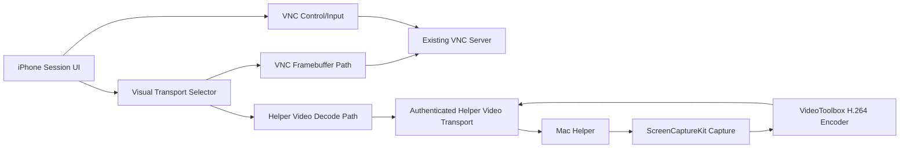

# Implementation Plan: Host Helper Video Stream

**Branch**: `007-host-helper-video-stream` | **Date**: 2026-06-06 | **Spec**: [spec.md](./spec.md)  
**Product**: Naru Remote  
**Input**: Feature specification from `/specs/007-host-helper-video-stream/spec.md`

## Summary

Add an optional helper visual transport that keeps VNC as the control and
fallback channel while a paired Mac helper captures the screen, encodes a
low-latency H.264 stream, and sends it to the iPhone app for display. This is a
response to the RFB performance evidence in `specs/004-rfb-encodings`: request
pacing and viewport request tuning improved the app, but the remaining startup
payload and sustained first-byte bottlenecks are server/update-source limited.

The first implementation must be benchmark-first and opt-in. It should not
change product defaults until the helper path beats the VNC low-traffic
candidate in the constrained-cellular benchmark and passes a physical iPhone
session gate.

## Technical Context

**Language/Version**: Swift 6 package code; macOS helper in Swift with
ScreenCaptureKit and VideoToolbox  
**Primary Dependencies**: NaruRemoteCore, NaruRemoteApp, NaruHelper,
ScreenCaptureKit, VideoToolbox, AVFoundation, Network framework  
**Storage**: Existing profile/app settings for non-secret opt-in state;
Keychain-backed pairing secret references reused from helper text bridge  
**Testing**: XCTest, fake helper stream, benchmark report fixtures, macOS helper
integration tests, physical iPhone + Mac manual gate  
**Target Platform**: iOS/iPadOS app plus optional macOS logged-in-user helper  
**Project Type**: iOS app + shared Swift package + macOS helper target  
**Performance Goals**: first useful paint and sustained update bands better
than the current VNC low-traffic candidate under constrained-cellular
conditioning; physical iPhone 30 minute sustained session without thermal
discomfort  
**Constraints**: App Store privacy posture, macOS Screen Recording permission,
helper optionality, private-network transport, no frame artifacts in logs  
**Scale/Scope**: One helper-video stream per active saved profile for the first
milestone; macOS is the first helper host, while iPhone remains the first
verification target

## Constitution Check

| Principle | Gate Question | Result |
| --- | --- | --- |
| Input Is Composed Locally | Does the feature define local composition, remote injection, fallback, and clipboard impact? | PASS |
| Tailnet-Native | Does the feature prefer private-network flows and avoid public-internet-first UX? | PASS |
| Verification Before Confidence | Is there a verification matrix with realistic evidence? | PASS |
| Security Boundaries | Are data crossing, retention, permissions, logs, and approvals defined? | PASS |
| Agent Traceability | Can tasks map to requirements, user stories, file ownership, and tests? | PASS |
| Phone-First, iPad-Graceful | Does the verification matrix list an iPhone path before iPad paths? | PASS |

## Architecture Decision

### Selected Approach

Use a dual-transport model:

1. VNC remains the authoritative session, control, input, clipboard, reconnect,
   diagnostic, and fallback transport.
2. A paired Mac helper exposes a separate authenticated helper-video stream
   only for trusted private profiles.
3. The helper captures screen frames with ScreenCaptureKit, encodes with a
   low-latency VideoToolbox H.264 pipeline, and sends length-framed stream
   messages over the helper transport.
4. The iPhone app decodes or displays video through platform video APIs and
   overlays existing session controls without sending input over the video
   channel.
5. Health monitoring switches the visual source back to the VNC framebuffer on
   stall, permission loss, codec rejection, auth failure, or revocation.
6. `VNCLiveBenchmark` adds a helper-video shape before product defaults change.

### Alternatives Considered

| Alternative | Why Rejected |
| --- | --- |
| Keep tuning RFB request cadence | D117 showed outstanding request depth 2/3 did not reduce the first-byte tail. |
| Make helper video replace VNC entirely | Too much control/input/security surface for the first milestone; VNC fallback is still valuable. |
| Use raw helper bitmap frames | Would repeat the traffic and heat problem that Raw VNC already has. |
| Use HEVC first | Better compression may be useful later, but H.264 has broader compatibility and a simpler first gate. |
| Public helper endpoint | Rejected by private-network posture and security boundary. |

## Data Flow



## Verification Matrix

| Requirement/User Story | Test Level | Tool/Environment | Evidence Required | Owner |
| --- | --- | --- | --- | --- |
| US1 / FR-001 / FR-002 | Unit + app model | XCTest fake helper | helper video selected while VNC control stays active | Agent |
| US1 / FR-004 | Unit | XCTest | stream stall falls back to VNC visual state | Agent |
| US2 / FR-006 | Unit | Benchmark fixture | helper-video report schema omits unsafe fields | Agent |
| US3 / FR-005 / SP-005 | Unit | Diagnostic JSON test | no frames, dimensions, endpoints, byte counts, exact timings, or tokens | Agent |
| SC-001 | Live benchmark | Mac helper + iPhone/simulator harness | constrained-cellular comparison artifact | Agent + human |
| SC-002 | Manual device | physical iPhone + Mac | 30 minute redacted manual log | Human |

## Project Structure

### Documentation

```text
specs/007-host-helper-video-stream/
├── spec.md
├── plan.md
├── research.md
├── data-model.md
├── quickstart.md
├── contracts/
│   └── helper-video-stream.md
└── tasks.md
```

### Source Code

Initial implementation PRs should use this subset:

```text
NaruRemote/Sources/NaruRemoteCore/HelperVideo/
NaruRemote/Sources/NaruRemoteCore/Diagnostics/
NaruRemote/App/AppShell/
NaruRemote/Tools/VNCLiveBenchmark/
NaruRemote/Tests/NaruRemoteCoreTests/
NaruRemote/Tests/NaruRemoteAppTests/
NaruHelper/Sources/NaruHelper/
NaruHelper/Tests/NaruHelperTests/
```

## Phase 0: Research

Research output is in [research.md](./research.md).

- RFB request/update limits and why helper video is now the next path.
- ScreenCaptureKit as the macOS capture source.
- VideoToolbox H.264 as the first encoder/decoder candidate.
- Authenticated helper transport and privacy-safe diagnostics.

## Phase 1: Design & Contracts

- [data-model.md](./data-model.md)
- [contracts/helper-video-stream.md](./contracts/helper-video-stream.md)
- [quickstart.md](./quickstart.md)

## Complexity Tracking

The feature adds a new visual transport and macOS screen-capture permission
boundary. Complexity is justified only because the VNC-only benchmark path has
reached server/update-source limits. The first milestone must remain opt-in,
benchmark-only for promotion, and reversible to the VNC framebuffer path.
