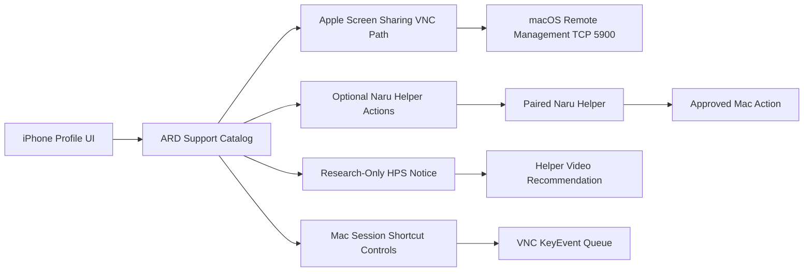

# Implementation Plan: Apple Remote Desktop Native Support Strategy

**Branch**: `008-apple-remote-desktop-native-support` | **Date**: 2026-06-17 | **Spec**: [spec.md](./spec.md)
**Product**: Naru Remote
**Input**: Feature specification from `/specs/008-apple-remote-desktop-native-support/spec.md`

## Summary

Add Apple-aware remote desktop support without overclaiming private ARD
protocol coverage. The first milestone is a support catalog and profile
diagnostic layer that tells users what Naru can do through public
VNC-compatible Apple Screen Sharing, what requires the optional Naru Helper,
what remains research-only, and what is unsupported. The performance path stays
aligned with `specs/007-host-helper-video-stream`: smoother visual transport is
implemented through Naru Helper Video unless a future public or licensed Apple
High Performance screen sharing path appears.

## Technical Context

**Language/Version**: Swift 6 package code, SwiftUI app shell, optional macOS helper
**Primary Dependencies**: NaruRemoteCore, NaruRemoteApp, NaruHelper, Network framework, existing diagnostics and helper capability models
**Storage**: Existing saved profile storage for profile kind and port; no new secrets
**Testing**: XCTest catalog/model tests, diagnostics redaction tests, simulator UI/screenshot checks after UI implementation
**Target Platform**: iPhone first, iPad graceful; macOS Remote Management/Screen Sharing as remote target
**Project Type**: Shared Swift package + iOS app shell + optional macOS helper capability catalog
**Performance Goals**: Avoid routing performance work into unsupported ARD protocol paths; keep smooth visual transport on the benchmarked helper-video path
**Constraints**: Private-network posture, App Store privacy, macOS Remote Management privileges, optional helper, no private-protocol reverse engineering
**Scale/Scope**: One Apple-aware profile at a time for the first milestone; future helpers can add management actions incrementally

## Constitution Check

| Principle | Gate Question | Result |
| --- | --- | --- |
| Input Is Composed Locally | Does the feature define local composition, remote injection, fallback, and clipboard impact? | PASS |
| Tailnet-Native | Does the feature prefer private-network flows and avoid public-internet-first UX? | PASS |
| Verification Before Confidence | Is there a verification matrix with realistic evidence? | PASS |
| Security Boundaries | Are data crossing, retention, permissions, logs, and approvals defined? | PASS |
| Agent Traceability | Can tasks map to requirements, user stories, file ownership, and tests? | PASS |
| Phone-First, iPad-Graceful | Does the verification matrix list an iPhone path before any iPad path? | PASS |

## Architecture Decision

### Selected Approach

Use a support-tier catalog:

1. `vncCompatible`: features available through public VNC-compatible Apple
   Screen Sharing, such as TCP `5900` control/observe and additional display
   port hints.
2. `helperBacked`: ARD-class features that require the optional paired Naru
   Helper, such as safe system-status buckets, user messages, file staging, and
   approved power/session actions.
3. `researchOnly`: features that Apple documents but Naru cannot implement
   directly yet, especially High Performance screen sharing.
4. `unsupported`: private ARD administrator behavior that Naru will not claim
   without a public, licensed, and review-approved integration path.

The app uses this catalog in profile setup, diagnostics, future session action
sheets, and VNC-compatible Mac session controls. It keeps VNC as the baseline
connection and keeps Helper Video as the product-owned high-performance visual
path.

### Alternatives Considered

| Alternative | Why Rejected |
| --- | --- |
| Reverse engineer Apple Remote Desktop native protocols | Conflicts with product security posture, verification requirements, and maintainability. |
| Present High Performance screen sharing as a selectable transport now | Apple documents strict Mac-to-Mac requirements, UDP ports, and high bandwidth; Naru has no public iOS client API for it. |
| Treat all Mac Remote Management as generic VNC | Leaves users confused about VNC password setup, extra display ports, administrator privileges, and helper upgrade path. |
| Put all ARD-class actions into helper video | Helper video is visual-only by design; management actions need separate approval and capability boundaries. |

## Data Flow



## Verification Matrix

| Requirement/User Story | Test Level | Tool/Environment | Evidence Required | Owner |
| --- | --- | --- | --- | --- |
| US1 / FR-001 / FR-002 | Unit | XCTest | Catalog maps Apple Screen Sharing to TCP `5900` and extra-display ports | Agent |
| US1 / FR-003 / FR-010 | Unit | Diagnostics fixture | Fixed labels only, no host/endpoint/payload fields | Agent |
| US2 / FR-007 / FR-008 | Unit | XCTest fake helper catalog | Actions disabled unless capability and approval policy pass | Agent |
| US3 / FR-004 / FR-005 / FR-006 | Unit | XCTest | High Performance screen sharing classified as research-only and routes to helper video | Agent |
| US4 / FR-011 / FR-012 / FR-013 | Unit + app model | XCTest | Mac controls map to fixed shortcuts, render only for active sessions, and preserve Compose draft | Agent |
| iPad graceful rendering | UI | iPad simulator screenshot | Same hints render without becoming primary gate | Agent |

## Project Structure

### Documentation (this feature)

```text
specs/008-apple-remote-desktop-native-support/
├── spec.md
├── plan.md
├── research.md
├── data-model.md
├── quickstart.md
├── contracts/
│   └── apple-remote-desktop-support-catalog.md
└── tasks.md
```

### Source Code (repository root)

```text
NaruRemote/Sources/NaruRemoteCore/AppleRemoteDesktop/
NaruRemote/Sources/NaruRemoteCore/Diagnostics/
NaruRemote/App/AppShell/
NaruRemote/Tests/NaruRemoteCoreTests/
NaruRemote/Tests/NaruRemoteAppTests/
NaruHelper/Sources/NaruHelper/
NaruHelper/Tests/NaruHelperTests/
```

**Structure Decision**: Start with pure catalog/model code in
`NaruRemoteCore/AppleRemoteDesktop` so tests can land before UI or helper
action implementation. Helper actions remain separate from helper video. Mac
session controls live in the same core namespace because they are Apple-aware,
but they use the existing VNC key-event queue and do not require helper pairing.

## Phase 0: Research

Research output is in [research.md](./research.md).

- Apple Remote Desktop VNC-compatible control boundary.
- Apple Remote Desktop encryption and privilege boundary.
- High Performance screen sharing requirements and why it is not a direct Naru
  transport yet.
- Helper-backed ARD-class action subset.
- VNC-compatible Mac session controls using documented macOS keyboard shortcuts.

## Phase 1: Design & Contracts

- [data-model.md](./data-model.md)
- [contracts/apple-remote-desktop-support-catalog.md](./contracts/apple-remote-desktop-support-catalog.md)
- [quickstart.md](./quickstart.md)

## Complexity Tracking

No constitution violations are planned. The feature intentionally avoids private
Apple protocol implementation and keeps all stronger actions behind optional
helper capability and explicit approval gates.
