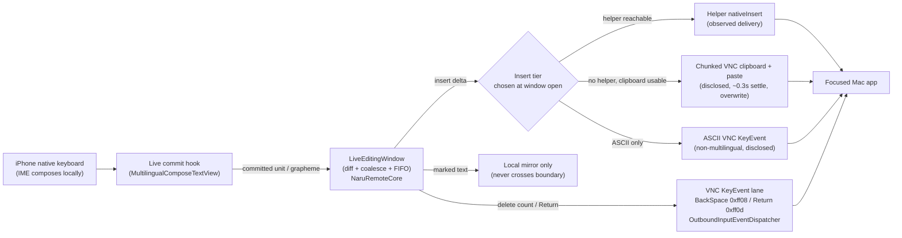

# Implementation Plan: Live Type-Through Input Mode

**Branch**: `009-live-type-through` | **Date**: 2026-07-05 | **Spec**: [spec.md](./spec.md)  
**Product**: Naru Remote  
**Input**: Feature specification from `/specs/009-live-type-through/spec.md`

## Summary

Add a third Remote Input Dock mode — **Live type-through** — peer to Compose & Send
(default, spec 006) and Direct Keystroke (spec 002). In Live mode, locally
IME-composed units flow to the remote insertion point *as they commit*, with no
Send tap: each composition-commit / grapheme boundary produces an insert delta
that is delivered through the injection adapter ladder (helper `nativeInsert`
primary → chunked VNC clipboard fallback → ASCII `KeyEvent` last resort).
In-window corrections (backspace, IME re-selection) reconcile the remote via
remote `BackSpace` key events on the VNC control-key lane (founder decision D1,
2026-07-05); `Return` flushes and seals the line on the same lane. The mode is
built as a pure state machine in `NaruRemoteCore` (window/diff/coalesce/seal),
wired into the `@MainActor` app model for dispatch and status surfacing, and
exposed through the existing dock UI (mode picker gains a Live segment; the
existing ⌫/↵ `ComposeQuickKey` action row is reused). Compose & Send stays the
constitution §I default; Live promotion to default is deferred to a later change
gated on physical-device evidence (founder decision D3).

## Technical Context

**Language/Version**: Swift 6 / Swift 6 concurrency; iOS 17+ app, `NaruRemoteCore` pure Swift  
**Primary Dependencies**: `NaruRemoteCore/RemoteInputDock` (`TextInjectionAdapter`, `KeystrokeEmitter`, `KeysymMapping`, `HelperTextBridge`, `NaruHelperNetworkTextInsertClient`), `NaruRemoteApp` (`NaruRemoteAppModel`, `OutboundInputEventDispatcher`), VNC `RFBNetworkClient` key/clipboard lanes  
**Storage**: In-memory only for the Live editing-window mirror (SP-002). Dock mode selection is non-persistent and resets to Compose on session start (FR-016). No new persisted state; no new Keychain items.  
**Testing**: `swift test` (Core state machine + app-model routing), fake helper recorder + `FakeRFBServerKit`, XCUITest storm (`ComposeInputResponsivenessUITests` pattern), live probes (`helper-text-observed-probe`, `text-keystroke-observed-probe`) as residual physical gates  
**Target Platform**: iOS/iPadOS (iPhone-first per §VI); remote target is macOS Screen Sharing (confirmed-transport evidence is macOS-specific)  
**Project Type**: Shared Swift package (`NaruRemoteCore`) + SwiftUI app (`NaruRemoteApp`); NO macOS helper changes (reuses spec 006 `nativeInsert` as-is — no delete-op contract extension in v1)  
**Performance Goals**: per-commit helper-path dispatch p95 in the few-hundred-ms class on a local private network, excluding permission prompts (SC-002); materially below the ~1–1.3 s batch per-sentence budget  
**Constraints**: App Store sandbox; no public helper exposure; no raw typed content in logs; single in-flight chunk with coalescing; no Unicode `KeyEvent` to macOS (FR-005); no cross-seal deletes (FR-011); NO new `NaruRemoteCore → UIKit` dependency (Core stays pure)  
**Scale/Scope**: One active session, one Live editing window at a time, line-bounded window; macOS-first

## Constitution Check

*GATE: passes before Phase 0; re-checked after Phase 1 design.*

| Principle | Gate Question | Result |
| --- | --- | --- |
| Input Is Composed Locally | Local composition, remote injection, fallback, clipboard impact defined? | PASS — marked text never leaves device (FR-002, IN-001); adapter ladder named (FR-004); clipboard fallback discloses overwrite + restore (IN-004); Live is commit-granularity, not raw Unicode streaming |
| Tailnet-Native | Prefers private-network flows, avoids public-internet-first UX? | PASS — rides existing VNC session + spec 006 pairing, no new public posture (TN-001/TN-003) |
| Verification Before Confidence | Verification matrix with realistic evidence? | PASS — iPhone-first matrix below; physical delivery/latency claims are residual gates, not assumed |
| Security Boundaries | Data crossing, retention, permissions, logs, approvals defined? | PASS — SP-001..SP-005; only fixed catalog states logged; in-memory mirror only; mode entry is the opt-in |
| Agent Traceability | Tasks map to requirements, user stories, file ownership, tests? | PASS — see `tasks.md`, disjoint write sets per phase |
| Phone-First, iPad-Graceful | iPhone path listed before any iPad path; iPad affordances layered not gating? | PASS — matrix leads with iPhone (simulator then physical); iPad is a graceful-scaling screenshot row |

No constitution violations planned. Live augments input; it does not replace RFB
viewing or the Compose default. Complexity is justified by the CRD-parity gap
(the batch per-sentence silence budget) identified in `PERFORMANCE_PARITY_ANALYSIS.md`.

## Architecture Decision

### Selected Approach

Three layers, matching the enforced module graph:

1. **Pure state machine — `NaruRemoteCore/RemoteInputDock`** (no SwiftUI/UIKit):
   - `LiveTypeThroughMode` value type: active flag, selected insert-adapter tier
     for the open window, persistent disclosure descriptor. Peer to
     `DirectKeystrokeMode`; resets to Compose default on session start (FR-016).
   - `LiveEditingWindow` state machine: holds the process-local delivered-text
     mirror, pending coalesced insert buffer, sealed flag, and fixed
     invalidation reason. Given a new committed-text snapshot + marked-text
     boundary, it computes the minimal forward-insert delta and the
     grapheme-count delete needed to reconcile (common-prefix diff on grapheme
     clusters, never splitting a cluster — FR-003). Emits an ordered op stream
     of `LiveInsertOperation` / `LiveDeleteOperation`.
   - Coalescing / FIFO / sealing rules live here as pure functions so they are
     unit-testable without a session (see Delivery/Coalescing below).
   - `LiveDeliveryStatus` fixed catalog for dock/diagnostic surfacing (FR-013).

2. **Wiring — `NaruRemoteApp/AppShell`** (`@MainActor`):
   - `NaruRemoteAppModel` gains Live mode state alongside `directKeystrokeMode`,
     a commit hook entry point, and the per-commit dispatch loop.
   - **Insert routing** picks one tier per window at open from current
     capability (helper reachable? → `nativeInsert`; else clipboard usable? →
     chunked clipboard paste; else ASCII-only → `KeyEvent`), then holds it for
     the window (FR-006). Helper inserts reuse `NaruHelperNetworkTextInsertClient`
     / `HelperTextInsertClient`; clipboard chunks reuse the existing Compose
     clipboard-provide + paste path; ASCII inserts reuse `KeystrokeEmitter`.
   - **Delete + line-boundary routing** (D1/FR-005/FR-010): both go through
     `OutboundInputEventDispatcher`'s key lane as `BackSpace` (`0xff08`) /
     `Return` (`0xff0d`) key events via `KeysymMapping`/`KeystrokeEmitter` —
     orthogonal to the insert tier, no helper contract change.
   - **Status surfacing**: maps `LiveDeliveryStatus` to the dock status line,
     including the degraded-clipboard disclosure (unconfirmed, ~0.3 s settle,
     clipboard overwritten) and the ASCII-only last-resort disclosure.

3. **Presentation — `NaruRemoteApp/Features/RemoteInputDock`** (view only):
   - `RemoteInputDockView.modePicker` becomes a 3-way segmented picker
     (Compose / Live / Direct) instead of the current Compose/Direct boolean.
   - `MultilingualComposeTextView` marked-text machinery (already resolves
     committed-vs-marked boundaries for Compose) drives the Live commit hook —
     the same commit-boundary detection, but each commit dispatches instead of
     accumulating a draft.
   - The existing ⌫/↵ `ComposeQuickKey` action row is reused verbatim as the
     always-visible Backspace/Enter buttons on the Live surface (D1, CRD
     pattern). Live shows its own persistent transport/latency disclosure badge
     (peer to Direct's "IME off" badge).

### Alternatives Considered

| Alternative | Why Rejected |
| --- | --- |
| Extend spec 006 helper contract with a native delete/backspace op | D1 chose the existing VNC `BackSpace` key lane (live-observed working for control keys); avoids a helper contract change + macOS helper release for v1 |
| Confine correction to the not-yet-delivered marked region (delivered text immutable) | Rejected by D1 — CRD-grade correction requires deleting already-delivered text within the window; sealing (FR-011) bounds the data-loss risk instead |
| Refuse Live without a helper (fall back to Compose semantics) | Rejected by D2 — offer disclosed chunked-clipboard Live so no-helper users still get type-through, with honest degraded disclosure |
| Deliver Unicode via `KeyEvent` when helper absent | Forbidden by live evidence (FR-005): Unicode keysyms never arrive on macOS Screen Sharing |
| Per-keystroke dispatch | Violates §I (marked text would leak) and floods the helper/remote; commit-granularity + coalescing is the design |
| Make Live the default now | Deferred by D3 to promotion time (post physical verification), with the §I amendment done then |
| Multi-window / read-back remote cursor | Naru cannot read the remote insertion point over VNC; single line-bounded window + aggressive sealing is the safety model |

## Delivery / Coalescing / Sealing Design

- **Single in-flight chunk, FIFO.** At most one delivery is in flight per window.
  While a chunk is in flight, subsequent commits **coalesce** into the pending
  insert buffer; when the in-flight chunk completes, the coalesced buffer flushes
  as the next single delivery (FR-008). Order is strictly preserved.
- **Deletes flush pending inserts first.** A `LiveDeleteOperation` must not
  reorder relative to inserts: it flushes any pending coalesced inserts, then
  emits `BackSpace` key events (FR-007). This keeps the remote from ever
  observing a delete applied before the insert it was meant to correct.
- **Rate limiting** protects the helper/remote from per-keystroke floods; bursts
  (fast typing, dictation block, pasteboard paste) collapse into fewer,
  order-preserving deliveries without dropping committed content.
- **Grapheme integrity.** Diffs operate on grapheme clusters; emoji / combining
  marks are delivered whole (FR-003, Edge Cases).
- **Sealing rules (FR-011).** The window seals — after which no delete may cross
  the seal — on any of: pointer/trackpad interaction (could move the remote
  cursor), helper `focusUnavailable`/focus-change, session leaving `.active`,
  app backgrounding, local keyboard focus loss, mode switch, disconnect/reconnect,
  profile change, or an insert-adapter failure. Sealing keeps delivered text at
  the remote, discards marked/uncommitted text, retains not-yet-delivered local
  text, and opens a fresh forward-only window on resume.

## Data Flow



## Verification Matrix

Per §VI, every user-facing row lists an iPhone path (physical first for
delivery/latency claims) before any iPad path.

| Requirement / User Story | Test Level | Tool / Environment | Evidence Required | Owner |
| --- | --- | --- | --- | --- |
| US1 / FR-002 / FR-003 / FR-004(helper) | Unit + app model | XCTest + fake helper recorder, iPhone sim | Per-commit helper request carries only committed unit; no VNC clipboard/paste/Unicode `KeyEvent`; marked text not sent | Agent |
| US2 / FR-001 / FR-012 | Unit (model) | XCTest, iPhone sim | 3-way switch preserves Compose draft, clears Direct modifiers, seals Live window | Agent |
| US3 / FR-007 / FR-009 / FR-010 (D1) | Unit + fake helper recorder | XCTest, iPhone sim | `hte`→⌫→`e`→Return yields ordered inserts + `BackSpace` key events + `Return` + seal | Agent |
| US4 / FR-004 / FR-014 (D2) | XCTest + FakeRFBServer | iPhone sim | No-helper: ASCII+Korean deliver via disclosed chunked clipboard; clipboard-blocked: Korean retained + safe failure; never Unicode `KeyEvent` | Agent |
| US5 / FR-006 / FR-011 | XCTest | iPhone sim | Pointer/focus-unavailable/disconnect each seal; no delete crosses seal on later backspace | Agent |
| SP-005 / SC-006 | Unit (privacy) | Diagnostic JSON assertion | No typed content/deltas/backspace counts/timings; only fixed catalog + buckets | Agent |
| FR-008 (coalescing/FIFO under load) | XCUITest storm | `ComposeInputResponsivenessUITests` pattern, iPhone sim | Rapid-typing storm: no loss/dup/reorder, single-in-flight coalescing holds | Agent |
| SC-001 / SC-003 integrity | Live probe + manual | `helper-text-observed-probe` (unicode-hangul), iPhone physical + Mac | 200-char mixed, 10 iterations: no loss/dup/reorder/mid-composition | Human (residual) |
| SC-002 latency | Live latency probe | per-commit probe extending `helper-text-observed-probe`, iPhone physical | commit→request/observed-insert p95 recorded | Human (residual) |
| FR-005 regression | Live probe | `text-keystroke-observed-probe` (unicode-hangul), iPhone physical + Mac | Unicode `KeyEvent` still `no-input` | Human (residual) |
| SC-007 sustained | Manual device | iPhone physical | 30-min live session: no desync/loss/unrecoverable state/thermal | Human (residual) |
| iPad graceful scaling | Screenshot / XCUITest | iPad-graceful | Live dock + disclosure render/behave after iPhone rows pass | Agent |

## Project Structure

### Documentation (this feature)

```text
specs/009-live-type-through/
├── spec.md      # Accepted 2026-07-05 (D1/D2/D3 resolved)
├── plan.md      # this file
└── tasks.md
```

`research.md`, `data-model.md`, `contracts/` are **N/A** for this slice: no new
persisted state (in-memory window only), no new external contract (deletes reuse
the existing VNC key lane; inserts reuse spec 006's contract unchanged). If a
future change adds a native helper delete op, it will add `contracts/` then.

### Source Code (repository root)

```text
NaruRemote/
├── Sources/NaruRemoteCore/RemoteInputDock/
│   ├── LiveTypeThroughMode.swift         # NEW — mode value type
│   └── LiveEditingWindow.swift           # NEW — window/diff/coalesce/seal state machine + op types + status
├── App/AppShell/
│   └── NaruRemoteAppModel.swift          # EDIT — Live mode state, commit dispatch, tier routing, delete/Return key lane, status
├── App/Features/RemoteInputDock/
│   └── RemoteInputDockView.swift         # EDIT — 3-way mode picker, Live commit hook, ⌫/↵ reuse, status line + disclosure badge
└── Tests/NaruRemoteCoreTests/
    ├── LiveEditingWindowTests.swift      # NEW — diff/coalesce/FIFO/seal unit tests
    └── LiveTypeThroughRoutingTests.swift # NEW — app-model tier routing / delete-as-BackSpace / privacy tests

NaruRemote/UITests/
└── LiveTypeThroughStormUITests.swift     # NEW — storm/responsiveness (ComposeInputResponsiveness pattern)
```

**Structure Decision**: State machine first in pure Core (fast `swift test`
inner loop, no UIKit dep), then app-model wiring, then view. Deletes/Return
reuse the VNC key lane so no macOS helper target changes in v1. `project.yml`
regeneration (`xcodegen generate`) is required after adding the new UITest file.

## Phase 0: Research

No open risky-API questions remain — the transport evidence was measured
2026-07-05 and encoded in the spec/founder decisions:

- Helper `nativeInsert` delivers Hangul with observed confirmation (primary).
- Unicode `KeyEvent` never arrives on macOS Screen Sharing → forbidden for text (FR-005).
- Control keys (`BackSpace`/`Return`/arrows) via `KeyEvent` are the working lane → deletes/line boundaries (D1).
- VNC clipboard + paste works, batch-only with ~0.3 s settle → disclosed degraded Live tier (D2).

Residual (out of scope, tracked as Non-Goal + residual task): non-macOS host
tiers, where Unicode keysyms may behave differently and helpers may not exist.

## Phase 1: Design & Contracts

- `data-model.md`: N/A (in-memory window only; no persisted state added).
- `contracts/`: N/A (reuses spec 006 `nativeInsert` unchanged; deletes/Return on existing VNC key lane).
- Key value types and their invariants are specified in the spec Key Entities
  section and realized in `LiveTypeThroughMode.swift` / `LiveEditingWindow.swift`.

## Complexity Tracking

No constitution violations. Live adds a state machine because the batch Compose
path cannot meet CRD-grade per-commit latency, and adds a disclosed degraded
clipboard tier (D2) rather than refusing Live without a helper. Retroactive
in-window delete (D1) adds correctness surface, bounded by aggressive sealing
(FR-011) to eliminate the cross-window data-loss hazard.
