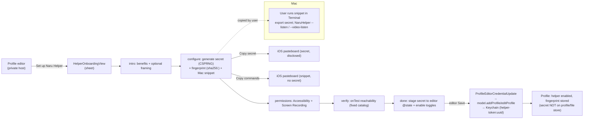

# Implementation Plan: Naru Helper Guided Onboarding

**Branch**: `010-helper-onboarding` | **Date**: 2026-07-05 | **Spec**: [spec.md](./spec.md)
**Product**: Naru Remote
**Input**: Feature specification from `/specs/010-helper-onboarding/spec.md`

## Summary

Turn helper pairing from a repo-docs chore into a phone-first guided sheet.
The flow (intro → configure → permissions → verify → done) is launched from the
profile editor for private hosts. The pure, testable logic — step machine,
CSPRNG secret generation, `sha256:` fingerprint, and the Mac setup-snippet
builder — lives in `NaruRemoteCore` with no SwiftUI/UIKit dependency. The
SwiftUI sheet (`HelperOnboardingView`) presents it, provides distinct
**Copy secret** / **Copy commands** actions, and on finish stages the generated
secret into the profile editor's existing `ProfileEditorCredentialUpdate` →
`model.addProfile`/`editProfile` → Keychain path (secret never on the profile
or file store, constitution §IV). Reachability verification reuses the editor's
existing `onTest` (`runProfileEditorReachabilityTest`) path; an in-flow
helper-handshake auto-test is deferred behind a named minimal model API. No
edits to `NaruRemoteAppModel.swift`, the app shell, or `RemoteInputDock`.

## Technical Context

**Language/Version**: Swift 6 / Swift 6 concurrency; iOS 17+ app, `NaruRemoteCore` pure Swift
**Primary Dependencies**: `NaruRemoteCore/ConnectionHub` (`ConnectionProfile`, `HelperTextBridgeConnectionConfiguration`, `HelperVideoConnectionConfiguration`, `ProfileEditorFormState`), `HelperTextBridgeAvailability`, `CryptoKit` (SHA-256 + `SymmetricKey` CSPRNG), `NaruRemoteApp` (`ProfileEditorView`, `ProfileEditorTestOutcome`); helper CLI shape from `NaruHelper` + `scripts/install-naru-helper-dev-app.sh`
**Storage**: Pairing secret in Keychain under `helper-token:<uuid>` / `helper-video-token:<uuid>` (only on editor Save, via existing path). Non-secret fingerprint on the profile. No new persistence type; the pure onboarding state holds no secret.
**Testing**: `swift test` (Core step machine + secret/fingerprint/snippet), app XCTest for the editor staging, iPhone simulator screenshots per step; real Mac pairing is a residual manual gate
**Target Platform**: iOS/iPadOS (iPhone-first per §VI); the helper being paired is macOS Screen Sharing + `NaruHelperDev.app`
**Project Type**: Shared Swift package (`NaruRemoteCore`) + SwiftUI app (`NaruRemoteApp`); NO macOS helper code changes (consumes the existing CLI)
**Constraints**: App Store sandbox; secret in Keychain only, never logged; no secret in the copy-able snippet (env indirection); no public helper exposure; NO new `NaruRemoteCore → UIKit` dependency; write set excludes `NaruRemoteAppModel.swift` / shell / `RemoteInputDock`
**Scale/Scope**: One profile at a time; one generated secret shared by text + video in v1

## Constitution Check

*GATE: passes before Phase 0; re-checked after Phase 1 design.*

| Principle | Gate Question | Result |
| --- | --- | --- |
| Input Is Composed Locally | Local composition, remote injection, fallback, clipboard impact defined? | PASS — this feature unlocks the confirmed local-composition transports; no remote injection of its own (IN-001..IN-005); iOS pasteboard use is explicit user action, disclosed |
| Tailnet-Native | Prefers private-network flows, avoids public-internet-first UX? | PASS — entry gated to private hosts; snippet assumes tailnet; public endpoints out of scope (TN-001/TN-003) |
| Verification Before Confidence | Verification matrix with realistic evidence? | PASS — iPhone-first matrix below; verify step is honest (host-reachable ≠ helper-live); real-Mac pairing is a residual manual gate |
| Security Boundaries | Data crossing, retention, permissions, logs, approvals defined? | PASS — SP-001..SP-005; secret in Keychain only, never in snippet/logs/pure state; disable + revoke affordances (FR-014) |
| Agent Traceability | Tasks map to requirements, user stories, file ownership, tests? | PASS — see `tasks.md`, disjoint write set (ConnectionHub + new files) |
| Phone-First, iPad-Graceful | iPhone path before any iPad path; iPad affordances layered not gating? | PASS — matrix leads with iPhone simulator; iPad is a graceful-scaling screenshot row |
| Helper Optional (Non-Goal) | Basic viewer works without helper? | PASS — abandoning onboarding leaves a working basic VNC profile (SC-005, constitution §V) |

No constitution violations planned. The helper stays optional; the flow only
makes the optional path self-serve.

## Architecture Decision

### Selected Approach

Three layers, matching the enforced module graph:

1. **Pure logic — `NaruRemoteCore/ConnectionHub/HelperOnboarding.swift`** (no SwiftUI/UIKit):
   - `HelperOnboardingStep` enum (`intro`/`configure`/`permissions`/`verify`/`done`) — `CaseIterable`, `Codable`; forward/back helpers.
   - `HelperOnboardingCapabilities` — which of text / video are being set up (defaults to both).
   - `HelperPairingSecret.generate()` — CSPRNG via CryptoKit `SymmetricKey(size: .bits256)`, base64url (no padding) → ≥256-bit, copy-safe alphabet.
   - `HelperPairingSecret.fingerprint(for:)` — `sha256:` + lowercase hex of SHA-256(secret UTF-8). Single source of truth; `ProfileEditorView` delegates to it to eliminate drift.
   - `HelperOnboardingSnippet.build(...)` — pure string builder from non-secret inputs (fingerprint, host, text port 5974, video port 5975, env-var names, capabilities). No secret.
   - `HelperOnboardingState` — step + secretGenerated flag + fingerprint + capabilities + last verification (fixed catalog). No raw secret.
   - `HelperOnboardingVerification` — fixed-catalog verify outcome.

2. **Verify reuse + named gap — `NaruRemoteApp/AppShell/NaruRemoteAppModel+HelperOnboarding.swift`** (extension only, public surface only):
   - `testHelperTextBridge(for:) async -> HelperTextBridgeProfileState` — a single-profile awaitable wrapper built on the existing public `refreshProfileReachability()` + `helperTextBridgeState` (trigger + bounded poll until availability leaves `.checking`). This is the ready-to-wire helper-handshake test; it needs one shell line to reach the view (see Named API Gap).
   - No stored properties added (extensions can't); flow state lives in the view / Core value type.

3. **Presentation — `NaruRemoteApp/Features/ConnectionHub/`** (view only):
   - `HelperOnboardingView.swift` (NEW) — the step sheet: intro copy, secret generation + fingerprint + snippet with **Copy secret** / **Copy commands**, permissions checklist, verify (via injected reachability runner), teardown pointer. Holds the raw secret transiently in `@State`, cleared on dismiss.
   - `ProfileEditorView.swift` (EDIT) — add the **Set up Naru Helper** entry for private hosts; present the sheet; on finish, stage the secret into `helperPairingSecret` / `helperVideoPairingSecret` `@State` and enable the toggle(s); reuse the existing `onTest` closure for the verify step; add an optional `onTestHelper` closure (default `nil`) for the future in-flow handshake test.

### Alternatives Considered

| Alternative | Why Rejected |
| --- | --- |
| Present the onboarding from the app shell as its own sheet | Shell is out of the write set; the editor already owns helper config + the Keychain save path + `onTest`, so it is the natural, in-write-set host |
| Persist the secret from the onboarding view directly to Keychain | Would duplicate the credential-store boundary; reusing the editor's `ProfileEditorCredentialUpdate` path keeps one constitution-compliant persistence route and defers writes to explicit Save |
| Fake a green helper-handshake result in the verify step | Violates §III honesty; instead ship host-reachability (real, existing path) and name the single-profile helper-test API for follow-up |
| Add the single-profile helper-test method to `NaruRemoteAppModel.swift` now | Out of the write set this pass (a parallel agent owns that file); the extension provides it on public surface so only shell wiring remains |
| Independent secrets for text vs video | v1 shares one secret (same Mac, same trust boundary); two Keychain refs both derive from it. Independent secrets are a later refinement |

## Named API Gap (report to team lead, do NOT implement here)

The in-flow **Test helper connection** (probe pairing + Accessibility + Screen
Recording for this one profile and await a result) is not reachable from the
editor today because the shell passes the editor only closures, and no
single-profile awaitable helper-test exists as a view-reachable path. v1 ships:

- The pure flow, secret, fingerprint, snippet (all testable now).
- The verify step on the existing host-reachability path (`onTest`).
- `NaruRemoteAppModel.testHelperTextBridge(for:)` in an extension (public
  surface: refresh + bounded poll of `helperTextBridgeState`).
- An optional `onTestHelper` closure on `ProfileEditorView` (default `nil`).

Remaining to activate the in-flow handshake test (owner: team lead, after the
parallel `NaruRemoteAppModel.swift` edit lands):

1. **Shell wiring (2 lines, forbidden to this agent)**: pass
   `onTestHelper: { await model.testHelperTextBridge(for: profileID) }` into both
   `ProfileEditorView(...)` call sites in `NaruRemoteAppShell.swift`.
2. *(Optional cleanliness)* a real single-profile probe on the model
   (`func testHelperTextBridge(for:) async -> HelperTextBridgeProfileState`
   backed by the private `probeHelperTextBridge`, replacing the extension's
   refresh+poll) — nicer than probing all profiles, not required for function.

## Data Flow



## Verification Matrix

Per §VI, every user-facing row lists an iPhone path before any iPad path.

| Requirement / User Story | Test Level | Tool / Environment | Evidence Required | Owner |
| --- | --- | --- | --- | --- |
| FR-004 secret CSPRNG / entropy / format | Unit (Core) | `swift test`, iPhone sim | Length, base64url alphabet, distinctness across N generations | Agent |
| FR-005 / SC-002 fingerprint parity | Unit (Core) | `swift test` | `sha256:`+hex equals editor algorithm for same secret | Agent |
| FR-006 / FR-007 snippet content | Unit (Core) | `swift test` | Install script, both permission flags, `--listen`/`--video-listen` + ports; no secret substring; env-var reference present | Agent |
| FR-002 step machine + capability select | Unit (Core) | `swift test` | Ordering, text-only/video-only variants | Agent |
| SP-002 / SC-004 state carries no secret | Unit (Core) | `swift test` | Encoded `HelperOnboardingState` has no secret | Agent |
| US1 / FR-012 staging to Keychain path | XCTest (app) | `swift test`, iPhone sim | On finish+Save, `ProfileEditorCredentialUpdate.helperPairingSecret` set; profile has fingerprint not secret | Agent |
| US3 / FR-010 verify fixed-catalog | XCTest (app) + screenshot | injected runner, iPhone sim | Catalog text only, no raw error | Agent |
| FR-001 entry gating by host kind | Screenshot / XCUITest | iPhone sim | Entry shown for private, hidden/discouraged for advanced public | Agent |
| FR-002 sheet renders one-handed | Screenshot | `xcrun simctl io screenshot`, iPhone sim | Per-step screenshots | Agent |
| SC-003 real Mac pairing end-to-end | Manual device | iPhone physical + Mac | Run snippet, grant permissions, helper `reachable`, Korean insert observed | Human (residual) |
| In-flow helper-handshake auto-test | XCTest (app) | after Named API Gap wired | `onTestHelper` returns availability; verify reflects it | Human (residual, blocked on shell wiring) |
| iPad graceful scaling | Screenshot | iPad-graceful | Sheet renders/behaves after iPhone rows pass | Agent |

## Project Structure

### Documentation (this feature)

```text
specs/010-helper-onboarding/
├── spec.md      # Accepted 2026-07-05 (founder-directed)
├── plan.md      # this file
└── tasks.md
```

`research.md` is N/A — the helper CLI, install script, permission flags, ports,
and Keychain/fingerprint conventions are all established in the codebase and
specs 006/007; this plan cites them directly. `data-model.md` is N/A — no new
persisted schema (reuses `ConnectionProfile` helper config + Keychain refs).
`contracts/` is N/A — the flow consumes the existing helper CLI unchanged.

### Source Code (repository root)

```text
NaruRemote/
├── Sources/NaruRemoteCore/ConnectionHub/
│   └── HelperOnboarding.swift                       # NEW — step machine, secret, fingerprint, snippet builder, state (pure)
├── App/AppShell/
│   └── NaruRemoteAppModel+HelperOnboarding.swift    # NEW — testHelperTextBridge(for:) on public surface (extension only)
├── App/Features/ConnectionHub/
│   ├── HelperOnboardingView.swift                   # NEW — the step sheet
│   └── ProfileEditorView.swift                      # EDIT — entry point, present sheet, stage secret, optional onTestHelper
└── Tests/
    ├── NaruRemoteCoreTests/HelperOnboardingTests.swift   # NEW — secret/fingerprint/snippet/step/privacy
    └── NaruRemoteAppTests/HelperOnboardingStagingTests.swift # NEW — editor staging → credential update (if reachable without shell)
```

**Structure Decision**: pure logic first in Core (fast `swift test`, no UIKit),
then the view, editing only `ProfileEditorView` in the app layer, with the model
touched only through a public-surface extension. `xcodegen generate` is required
after adding app-target files.

## Phase 0: Research

No open risky-API questions. Established facts consumed directly:

- Helper text bridge: `NaruHelper --listen --token-env <NAME> [--port 5974]` (Accessibility). Default port `naruHelperTextBridgeDefaultPort = 5974`. Direct `--token` is rejected (2026-07-05) — env indirection is enforced on both listeners.
- Helper video: `NaruHelper --video-listen --token-env <NAME> --profile-fingerprint-env <NAME> [--port 5975]` (Screen Recording); direct `--token`/`--profile-fingerprint` are rejected → env indirection is enforced on the video path. Default port `naruHelperVideoStreamDefaultPort = 5975`.
- Install/permissions: `scripts/install-naru-helper-dev-app.sh` builds `NaruHelperDev.app` (stable TCC identity); `--request-text-permission` (Accessibility), `--request-permission` (Screen Recording). Helper executable at `$HOME/Applications/NaruRemoteDev/NaruHelperDev.app/Contents/MacOS/NaruHelper`.
- Keychain/fingerprint: secret under `helper-token:<uuid>` / `helper-video-token:<uuid>`; fingerprint `sha256:` + lowercase hex SHA-256(secret) (matches `ProfileEditorView.pairingFingerprint`).
- Reachability: `runProfileEditorReachabilityTest(host:port:password:)` (public, awaitable, catalog-safe) via the editor's `onTest`. Helper availability: `refreshProfileReachability()` + `helperTextBridgeState` (public); `disableHelperTextBridge`/`revokeHelperTextBridge` for teardown.

~~Residual: the text `--listen` path took the secret as `--token` on argv~~ —
**resolved 2026-07-05**: `--listen` now rejects `--token` and requires
`--token-env`, matching the video listener, so the pairing secret never reaches
argv (`ps`) on the Mac. The same change fixed a latent `--listen` bug where the
process exited immediately after start (`RunLoop.main.run()` returns with no
scheduled sources under `NWListener`); the listener now parks async like
`--video-listen` and actually serves. Verified live: reject paths exit 2 with
fixed messages, env path opens the port.

## Phase 1: Design & Contracts

- `data-model.md`: N/A (reuses `ConnectionProfile` helper config + Keychain refs).
- `contracts/`: N/A (consumes existing helper CLI unchanged).
- Key value types and invariants are in the spec Key Entities section, realized in `HelperOnboarding.swift`.

## Complexity Tracking

No constitution violations. Complexity is intentionally minimized: pure Core
logic + one view + one editor edit + a public-surface model extension, with the
single genuinely-blocked capability (in-flow helper-handshake test) named as a
2-line shell follow-up rather than forced in against the write-set boundary.
